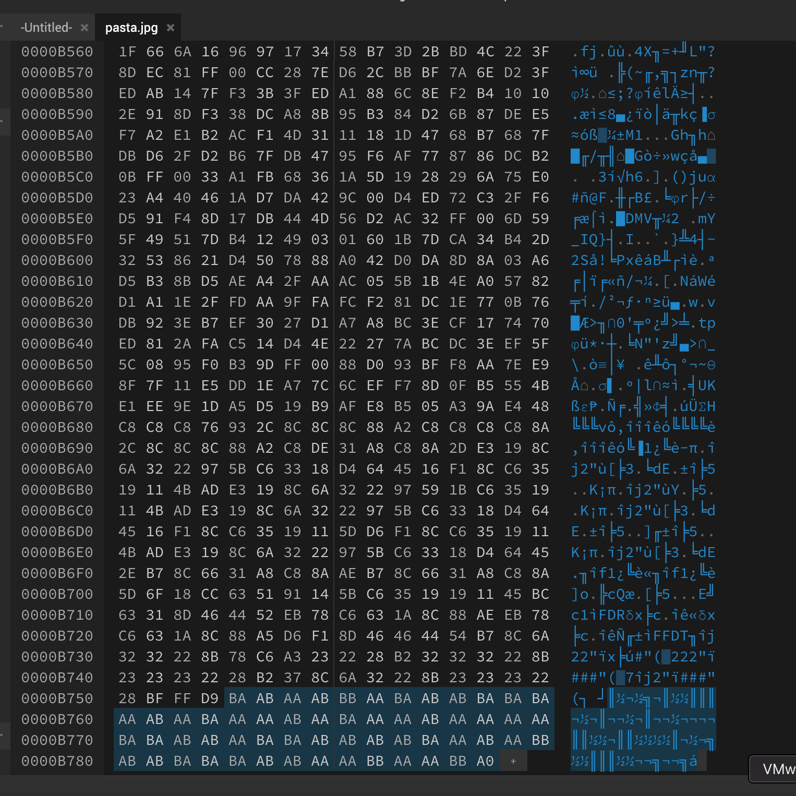

# Restaurant
Author: ScourgeXV

Points: 152 (123 Solves)
## Description
I just asked for my favourite pasta and they gave me this. Are these guys STUPID? Maybe in the end they may give me something real. (Wrap the text in KashiCTF{})
## Attachments
[pasta.jpg](Attachments/pasta.jpg)
## Solution
- This line immediately caught my attention `Maybe in the end they may give me something real.`. The `in the end` part made me think that there might be something hidden in the last few bytes of the image.
- I opened the image in a [hex editor](https://hexed.it/) and immediately saw that there are some bytes after the `FF D9` marker which is the end of the JPEG data stream. You can read more about it [here](https://en.wikipedia.org/wiki/JPEG_File_Interchange_Format). 
- I noticed the bytes were either `AA`, `AB`, `BA`, or `BB` (with the exception of the last byte which was `A0`). I ruled out morse code as there were 4 different bytes and Morse code only requires maximum 3 symbols (dot, dash, space).
- I thought that this could be binary, so I tried considering `A` as `0` and `B` as `1` (and vice versa), but that lead to gibberish.
- I extracted the bytes and asked an LLM what cipher could it be. It suggested that it could be a [Baconian cipher](https://en.wikipedia.org/wiki/Bacon%27s_cipher).
- I went to a [Baconian cipher decoder](https://cryptii.com/pipes/bacon-cipher) and tried decoding the bytes. The bytes decoded to `theywerereallllycooking`.
- I wrapped the decoded text in the flag format and submitted the flag `KashiCTF{theywerereallllycooking}` but it was incorrect.
- I opened a ticket to ask where I went wrong. The organizers said that the flag is in uppercase. I submitted the flag `KashiCTF{THEYWEREREALLLLYCOOKING}` and it was correct.