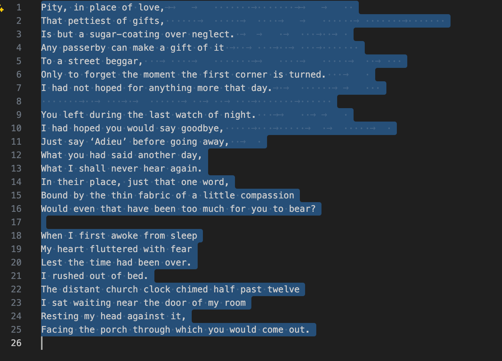

# SNOWy Evening
Points: 205 (116 Solves)
## Description
A friend of mine , Aakash has gone missing and the only thing we found is this poem...Weirdly, he had a habit of keeping his name as the password.
## Attachments
[poemm.txt](Attachments/poemm.txt)
## Solution
- I chased a lot of dead ends with this one. I was overthinking a lot lol.
- I first Googled the poem, it's [At The Last Watch](https://allpoetry.com/At-The-Last-Watch) by Robert Frost.
- I also Googled `SNOWy Evening` and found another poem by Robert Frost called [Stopping by Woods on a Snowy Evening](https://www.poetryfoundation.org/poems/42891/stopping-by-woods-on-a-snowy-evening).
- Since the challenge description mentioned something about a password, I thought that perhaps I need to log in to some site with both username and password as `Aakash`.
- I tried some poetry sites like [AllPoetry](https://allpoetry.com/login) but to no avail. The challenge title prompted me to search for `SNOWE` so I thought it might be related to [this](https://snowehome.com/). Since `SNOW` was capitalised in the title, I also searched for `SNOW cybersecurity` and found [this](https://www.cybersecurityintelligence.com/snow-software-2200.html) page. I tried logging in here too with the credentials I thought of but it didn't work.
- I was obviously very lost at this point. I created a ticket for a sanity check and the organizers told me that it's related to [Stego](https://en.wikipedia.org/wiki/Steganography).
- My honest reaction was "Huhh, how could it be stego? How can you even hide anything in a text file?". I Googled `SNOW stego` and found [this](https://darkside.com.au/snow/):
```
The program SNOW is used to conceal messages in ASCII text by appending whitespace to the end of lines. Because spaces and tabs are generally not visible in text viewers, the message is effectively hidden from casual observers. And if the built-in encryption is used, the message cannot be read even if it is detected.
```
- And indeed, if I select everything in the [poemm.txt](Attachments/poemm.txt) file in a text editor, white spaces are clearly visible at the end of the first few lines. 
- I ran `brew install snow` to install the `snow` program on my Mac. I then ran `snow -C -p Aakash Attachments/poemm.txt` to extract the hidden message. The command does the following:
  - `-C` is used to extract the hidden message.
  - `-p Aakash` is the password.
  - `Attachments/poemm.txt` is the file to extract the message from.
- After running the command, I got a [Pastebin](https://pastebin.com/) link: https://pastebin.com/HVQfa14Z.
- I opened a link and saw a note with the title `Mooooooo` and the following text:
```
OOOMoOMoOMoOMoOMoOMoOMoOMoOMMMmoOMMMMMMmoOMMMMOOMOomOoMoOmoOmoomOo
MMMmoOMMMMMMmoOMMMMOOMOomOoMoOmoOmoomOoMMMmoOMMMMMMmoOMMMMOOMOomOo
MoOmoOmooOOOmoOOOOmOomOoMMMmoOMMMMOOMOomoOMoOmOomoomoOMoOMoOMoOMoO
MoOMoOMoOMoOMoOMoOMoOMoomOoOOOmoOOOOmOomOoMMMmoOMMMMOOMOomoOMoOmOo
moomOomOoMMMmoOmoOMMMMOOMOomoOMoOmOomoomoOMoOMoomOoOOOmoOOOOmOomOo
MMMmoOMMMMOOMOomoOMoOmOomoomOomOoMMMmoOmoOMMMMOOMOomoOMoOmOomoomOo
mOomOoMMMmoOmoOmoOMMMMOOMOomoOMoOmOomoomoOMoOMoOMoOMoomOoOOOmoOOOO
mOomOoMMMmoOMMMMOOMOomoOMoOmOomoomOomOoMMMmoOmoOMMMMOOMOomoOMoOmOo
moomoOMoOMoOMoOMoOMoOMoOMoOMoOMoomOoOOOmoOOOOmOomOoMMMmoOMMMMOOMOo
moOMoOmOomoomOomOoMMMmoOmoOMMMMOOMOomoOMoOmOomoomoOMoOMoOMoOMoOMoO
MoOMoOMoOMoOMoomOoOOOmoOOOOmOomOoMMMmoOMMMMOOMOomoOMoOmOomoomoOMoO
MoOMoOMoomOoOOOmoOOOOmOomOoMMMmoOMMMMOOMOomoOMoOmOomoomOomOomOoMMM
moOmoOmoOMMMMOOMOomoOMoOmOomoomoOMoOMoOMoOMoOMoomOoOOOmoOOOOmOomOo
MMMmoOMMMMOOMOomoOMoOmOomoomoOMoOMoOMoOMoOMoOMoOMoomOoOOOmoOOOOmOo
mOoMMMmoOMMMMOOMOomoOMoOmOomoomOomOoMMMmoOmoOMMMMOOMOomoOMoOmOomoo
mOomOomOoMMMmoOmoOmoOMMMMOOMOomoOMoOmOomoomoOMoOMoOMoOMoOMoOMoOMoO
MoOMoOMoOMoOMoomOoOOOmoOOOOmOomOoMMMmoOMMMMOOMOomoOMoOmOomoomoOMoO
MoOMoOMoOMoOMoOMoOMoOMoOMoOMoOMoOMoomOoOOOmoOOOOmOomOoMMMmoOMMMMOO
MOomoOMoOmOomoomOomOoMMMmoOmoOMMMMOOMOomoOMoOmOomoomoOMoOMoOMoOMoO
MoOMoOMoOMoOMoOMoOMoOMoOMoOMoOMoOMoomOoOOOmoOOOOmOomOoMMMmoOMMMMOO
MOomoOMoOmOomoomOomOoMMMmoOmoOMMMMOOMOomoOMoOmOomoomOomOomOoMMMmoO
moOmoOMMMMOOMOomoOMoOmOomoomoOMoOMoOMoOMoOMoOMoOMoomOoOOOmoOOOOmOo
mOoMMMmoOMMMMOOMOomoOMoOmOomoomOomOoMMMmoOmoOMMMMOOMOomoOMoOmOomoo
moOMoOMoOMoOMoOMoOMoomOoOOOmoOOOOmOomOoMMMmoOMMMMOOMOomoOMoOmOomoo
mOomOomOoMMMmoOmoOmoOMMMMOOMOomoOMoOmOomoomoOMoOMoOMoOMoOMoOMoOMoO
MoOMoOMoOMoOMoOMoOMoOMoOMoomOoOOOmoOOOOmOomOoMMMmoOMMMMOOMOomoOMoO
mOomoomoOMoOMoOMoOMoOMoOMoOMoOMoOMoomOoOOOmoOOOOmOomOoMMMmoOMMMMOO
MOomoOMoOmOomoomOomOoMMMmoOmoOMMMMOOMOomoOMoOmOomoomOomOomOoMMMmoO
moOmoOMMMMOOMOomoOMoOmOomoomoOMoOMoOMoOMoOMoOMoomOoOOOmoOOOOmOomOo
MMMmoOMMMMOOMOomoOMoOmOomoomOomOoMMMmoOmoOMMMMOOMOomoOMoOmOomoomOo
mOomOoMMMmoOmoOmoOMMMMOOMOomoOMoOmOomoomoOMoOMoOMoomOoOOOmoOOOOmOo
mOoMMMmoOMMMMOOMOomoOMoOmOomoomOomOoMMMmoOmoOMMMMOOMOomoOMoOmOomoo
mOomOomOoMMMmoOmoOmoOMMMMOOMOomoOMoOmOomoomoOMoOMoOMoOMoOMoomOoOOO
moOOOOmOomOoMMMmoOMMMMOOMOomoOMoOmOomoomOomOoMMMmoOmoOMMMMOOMOomoO
MoOmOomoomOomOomOoMMMmoOmoOmoOMMMMOOMOomoOMoOmOomoomoOMoOMoOMoOMoo
mOoOOOmoOOOOmOomOoMMMmoOMMMMOOMOomoOMoOmOomoomOomOomOoMMMmoOmoOmoO
MMMMOOMOomoOMoOmOomoomoOMoOMoOMoOMoOMoOMoOMoOMoOMoOMoOMoOMoOMoOMoO
MoOMoomOoOOOmoOOOOmOomOomOoMMMmoOmoOMMMMOOMOomoOMoOmOomoomOomOomOo
MMMmoOmoOmoOMMMMOOMOomoOMoOmOomoomoOMoOMoOMoOMoOMoOMoomOoOOOmoOOOO
mOomOomOoMMMmoOmoOMMMMOOMOomoOMoOmOomoomOomOomOoMMMmoOmoOmoOMMMMOO
MOomoOMoOmOomoomoOMoOMoOMoOMoOMoOMoOMoOMoomOoOOOmoOOOOmOomOomOoMMM
moOmoOMMMMOOMOomoOMoOmOomoomOomOomOoMMMmoOmoOmoOMMMMOOMOomoOMoOmOo
moomoOMoOMoOMoOMoomOoOOOmoOOOOmOomOomOoMMMmoOmoOMMMMOOMOomoOMoOmOo
moomOomOomOoMMMmoOmoOmoOMMMMOOMOomoOMoOmOomoomoOMoOMoOMoOMoOMoomOo
OOOmoOOOOmOomOoMMMmoOMMMMOOMOomoOMoOmOomoomOomOoMMMmoOmoOMMMMOOMOo
moOMoOmOomoomoOMoOMoOMoomOoOOOmoOOOOmOomOomOoMMMmoOmoOMMMMOOMOomoO
MoOmOomoomOomOomOoMMMmoOmoOmoOMMMMOOMOomoOMoOmOomoomoOMoOMoOMoOMoO
MoOMoomOoOOOmoOOOOmOomOoMMMmoOMMMMOOMOomoOMoOmOomoomOomOoMMMmoOmoO
MMMMOOMOomoOMoOmOomoomoOMoOMoOMoOMoOMoOMoOMoomOoOOOmoOOOOmOomOoMMM
moOMMMMOOMOomoOMoOmOomoomOomOoMMMmoOmoOMMMMOOMOomoOMoOmOomoomOomOo
mOoMMMmoOmoOmoOMMMMOOMOomoOMoOmOomoomoOMoOMoOMoOMoOMoOMoOMoOMoOMoO
MoOMoOMoOMoOMoomOo
```
- This seems to be a cipher of some sort. I Googled `moo cipher` and the [top result](https://mysterytoolbox.organisingchaos.com/Ciphers/cipher/Moo) was indeed a `Moo (Cow)` cipher decoder. I entered the encoded text and got the decoded text: `KashiCTF{Love_Hurts_5734b5f}`.
- The flag is `KashiCTF{Love_Hurts_5734b5f}`.