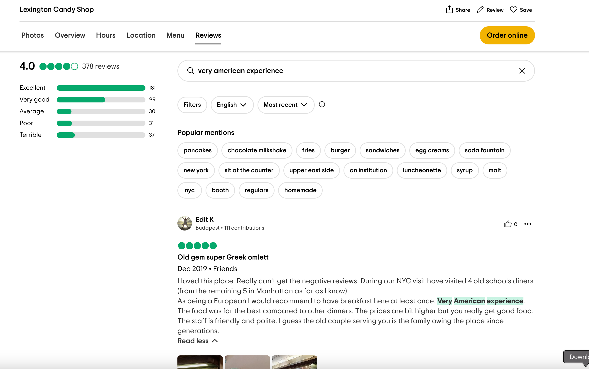
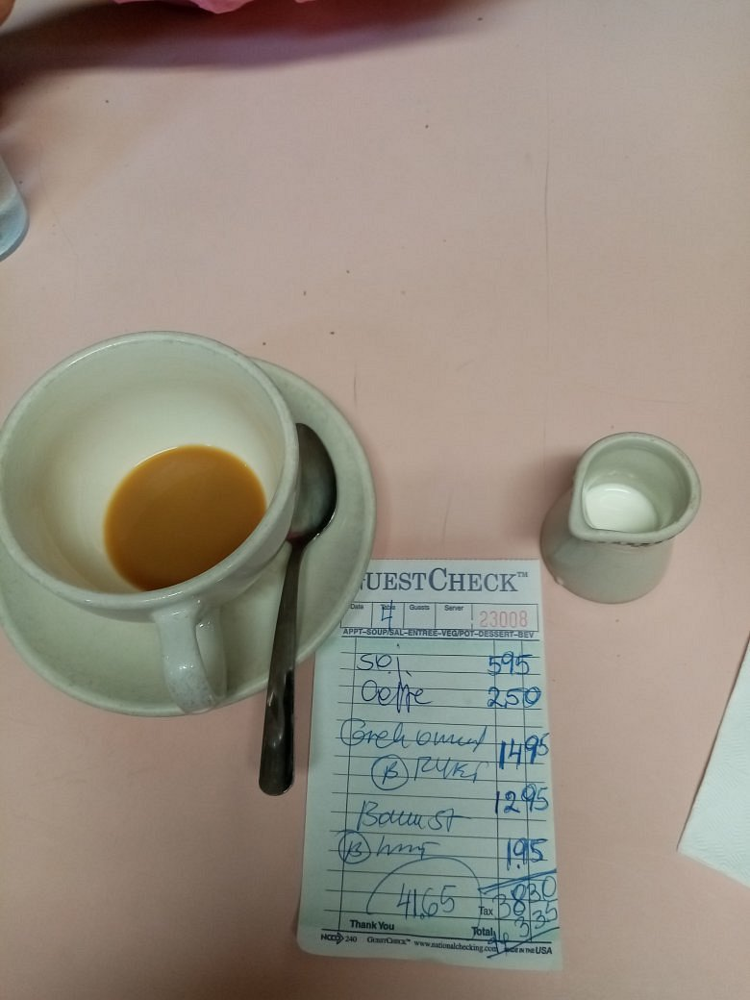

# Old Diner
Author: shinigami-777

Points: 411 (56 Solves)
## Description
My friend once visited this place that served ice cream with coke. He said he had the best Greek omlette of his life and called it a very american experience. Can you find the name of the diner and the amount he paid?

Flag Format: `KashiCTF{Name_of_Diner_Amount}`

For clarification on the flag format The diner's name is in title case with spaces replaced by underscores. The amount is without currency sign, and in decimal, correct to two decimal places, i.e. `KashiCTF{Full_Diner_Name_XX.XX}`
## Solution
- There are actually a lot of diners that serve ice cream with coke and Greek omelette in the US, so it took me a while to find the right one.
- I Googled this query: `old diner in the US serving ice cream with coke`, and the top result was a diner called `Lexington Candy Shop` in NYC. Now I needed to find the amount he paid.
- I was a bit unsure about what to consider exactly as the items he paid for. I went with only `Greek omelette` and referred to the [menu](https://www.lexingtoncandyshop.com/s/Lexington-Candy-Shop_076-382663_5264700_042024_to-go-PRINT-NO-CROP.pdf) to find the price of the omelette. The price was $17.50.
- I tried submitting the flag `KashiCTF{Lexington_Candy_Shop_17.50}` but it was incorrect. I then tried several other combinations including the price of the coke and ice cream etc, but none of them worked.
- I opened a ticket to ask whether only the price of the omelette should be considered and were there any extra charges included. The organizers replied with `the order is not mentioned taxes are included as well`.
- I went back to the drawing board and read the description again. This line caught my attention `called it a very american experience`. I Googled `lexington candy shop "very american experience"`. The top result was this [TripAdvisor page](https://www.tripadvisor.com.sg/Restaurant_Review-g60763-d522599-Reviews-Lexington_Candy_Shop-New_York_City_New_York.html).
- Scrolling down a bit and going to the reviews section, there's a very convenient `Search` feature. I searched for `very american experience` and found this review. 
- The review has a few attachments, one of which is the receipt:  The receipt shows the total amount paid as $41.65.
- I submitted the flag `KashiCTF{Lexington_Candy_Shop_41.65}` and it was correct.