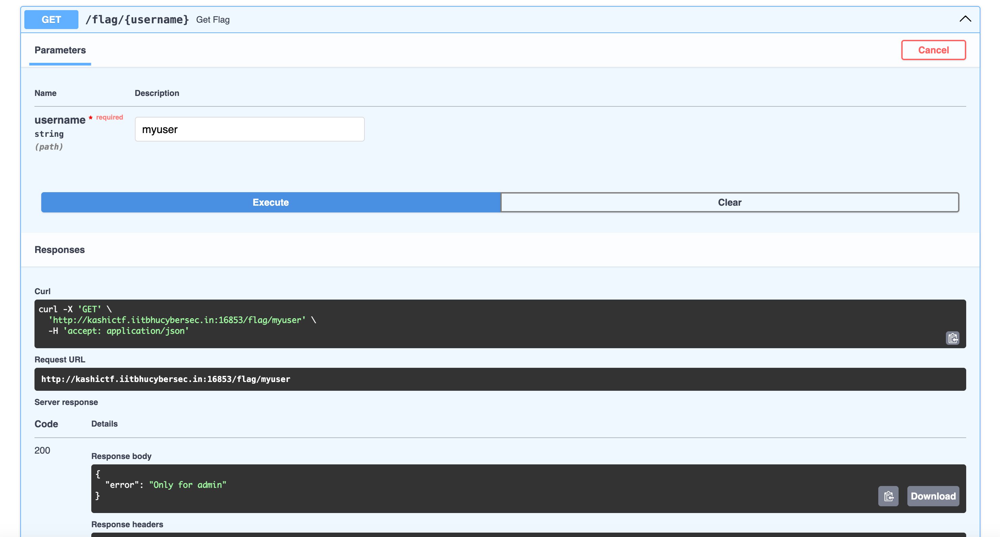

# SuperFastAPI
Points: 100 (189 Solves)
## Description
Made my verty first API!

However I have to still integrate it with a frontend so can't do much at this point lol.
## Instance
- We can launch our own instance of the chall. But no source code is provided. 
## Solution
- I'm pretty bad at web challenges, the only reason I tried this one was because it had so many solves so I thought it would be relatively easy.
- Visiting the instance, as the challenge description suggests, there is no frontend. We only see the text: `{"message":"Welcome to my SuperFastAPI. No frontend tho - visit sometime later :)"}`.
- The challenge title strongly suggests that [FastAPI](https://fastapi.tiangolo.com/) is being used. I tried visiting the `/docs` endpoint and it worked. 
- The `/docs` endpoint is a built-in feature of FastAPI that provides interactive documentation for the API. It's very useful for developers to test the API and see what endpoints are available.
- So seems like we can use the `/create` endpoint to create a new user and then use the `/flag/{username}` endpoint to get the flag. 
- I discovered that I can use the `Try it out` button to send requests to the API. This was very useful as I didn't have to write any code to interact with the API. 
- I created a new user with the username `myuser`.  and got the server response that the user was created successfully. 
- I then sent a request to the `/flag/myuser` endpoint but got an error. 
- So it's not that easy :( I guess I need to explore the other endpoints too. I tried the `/get` endpoint  
- One thing that immediately caught my eye was the new `role` parameter in the Response body. This wasn't present in the Example Value in the `/create` endpoint. It seems to be set to `guest` by default. Perhaps I need to change this to `admin` to get the flag.
- I went to the `/update` endpoint and added the `role` parameter with the value `admin`.  I got the response that the user was updated successfully. 
- I then sent a request to the `/flag/myuser` endpoint again and got the flag. 
- The flag is `KashiCTF{m455_4551gnm3n7_ftw_otbGxoGR2}`.